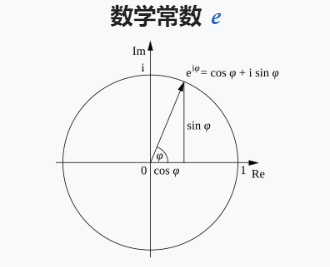
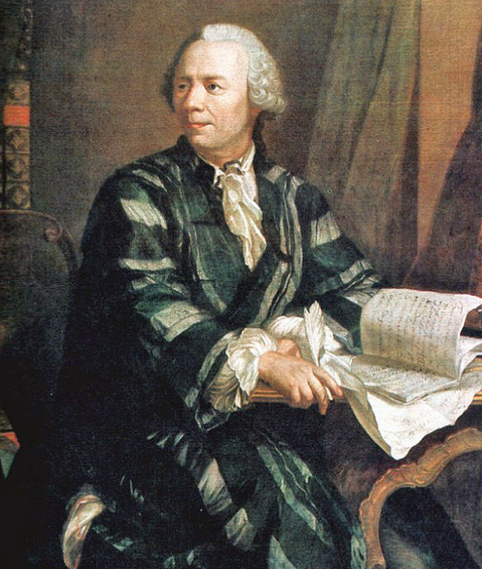

## 1. 导入

也许你在某些场合听说过欧拉公式，也许你干脆对数学不感冒。机缘巧合下，你点开了这篇文章，大致浏览了下然后关闭，继续为自己的工作学习忙碌。这不妨碍你暂停忙碌的脚步，欣赏她的美。
若干年后，你应该不曾记得看过这篇文章，但你会记得数学界有一个很美的公式。

## 2. 欧拉公式

***欧拉公式***（Euler's formula）是复分析领域的公式，它将三角函数与复指数函数关联起来，因其提出者莱昂哈德·欧拉而得名。欧拉公式提出，对任意实数 x，都存在：
$$
e^{ix} = \cos(x) + i\sin(x)
$$ 
其中 e是自然对数的底数，i是虚数单位，而 cos和 sin则是余弦、正弦对应的三角函数，参数 x则以弧度为单位。

这是一个非常美丽的公式，它将三角函数，指数函数，复数联系在了一起，是数学中的一颗明珠。

## 3.欧拉恒等式

***欧拉恒等式***（Euler's identity）是欧拉公式的一个特例，当 x = π 时，欧拉公式变为：
$$
e^{i\pi} + 1 = 0
$$
这个公式被认为是数学中最美丽的公式之一，它将五个最重要的数学常数联系在了一起：0、1、e、i和π。

## 4. 欧拉的贡献

莱昂哈德·欧拉（1707年4月15日—1783年9月18日），瑞士数学家、物理学家、天文学家、地理学家、逻辑学家和工程师。近代数学先驱之一。

欧拉在包括微积分和图论在内的多个数学领域都做出过重大贡献。他引进和推广了许多数学术语和书写格式，并一直沿用至今，例如：
- 函数的记法 $f(x)$ ；
- 虚数单位$\sqrt {-1}$的记法 $i$；
- 圆周率的记法 $\pi$；
- 求和符号$\Sigma$；
- 差分符号$\Delta$
- 用小写字母表示三角形的边和用大写字母表示三角形的角等；
- 给出了自然对数的底数$e$定义，其也称为欧拉数（Euler's number；
- 此外，他还在力学、流体动力学、光学、天文学和乐理领域有突出的贡献。

欧拉是18世纪杰出的数学家，同时也是有史以来最伟大的数学家之一。他也是一位多产作者，其学术著作有60-80册。

欧拉逝世后，几位著名的数学家高度评价他对数学的贡献，例如法国数学家***皮埃尔-西蒙·拉普拉斯***曾这样评价欧拉对于数学的贡献：“读欧拉的著作吧，在任何意义上，他都是我们的大师”。

德国数学家***卡尔·弗里德里希·高斯***曾写道：“对欧拉所有的著作的研究将永远是数学各个领域最好的学习之所，没有任何其他东西可以取代它”。

## 参考

[1] [wiki 莱昂哈德·欧拉](https://zh.wikipedia.org/wiki/%E8%90%8A%E6%98%82%E5%93%88%E5%BE%B7%C2%B7%E6%AD%90%E6%8B%89)

[2] [GitHub: LLMForEverybody](https://github.com/luhengshiwo/LLMForEverybody)

