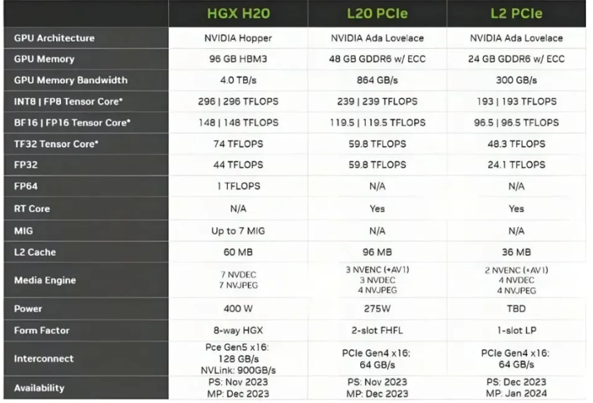

私有化部署大模型性能估计

## 私有化部署？

如果你也在这波DeepSeek R1私有化部署的浪潮里，你的老板可能会让你预估下部署一个XX版本的模型需要什么样的硬件资源，TPS是多少。为此，你也许会上网搜索各种测试，你可能会看到这样的图：


这些测评基本上都是机构或者网友基于自己的机器测出来的值，有没有什么方法能够让我们快速估计出一个值作为整体的考量，即使它没有那么精准？

今天，我会带大家一起梳理一下

1. 大模型推理的性能指标有哪些
2. 大模型推理的性能和什么相关
3. 如何快速通过已有的信息，估计出大模型的理论推理性能极限

## 1. 大模型推理的性能指标

你可能会听过这些词：TTFT，TPOT，Throughput, Latency,TPS等术语，我们来看他们分别代表什么意思：

- TTFT(Time To First Token)
  即首token延迟，指的都是从输入到输出第一个token 的延迟, 
  在大模型的推理阶段引用了KV Cache，所以会有两个阶段：Prefilling和Decoding阶段，TTFT指的是大模型对prompt完成了KV 缓存的动作，并生成第一个Token的时间

- TPOT(Time Per Output Token), 
  在Decoding阶段，平均每个输出 token 的延迟（不含首个Token）

- Lantency(延迟)
  - 理论上即从输入到输出最后一个 token 的时间，原则上的计算公式是：Latency = (TTFT) + (TPOT) * (number of tokens)；

- TPS(Tokens Per Second)
  - 一般指单个请求的每秒token数，有时候也是并发请求的总吞吐量，注意上下文即可。 计算方式是 number of tokens / Latency；

- Throughput 吞吐量
  - 如果有并发的时候，多个请求每秒总token数量

## 2. 大模型性能影响因子

那么哪些因子会影响大模型的性能呢？

它和大模型本身，推理使用的GPU，用了什么框架，prompt的长度，并发量等等都有关系，下面我们具体来看

### 2.1. 大模型本身

  首先我们要看模型的架构是Dense还是MoE。对于Dense架构的，在推理的时候会激活所有参数；对于MoE架构，例如DeepSeek R1，模型本身有671B，但激活的只有37B. 推理速度和激活的参数大小有关；

  同时，每一个参数可能会用不同的精度，比如BF16，Int8等等，精度越小推理速度就越快。


### 2.2 GPU

GPU有很多参数，对大模型推理来说，主要的有三个：显存大小，计算能力，通信速度. 我们依次来看下：


当我们说显卡的显存时，我们一般指的是类似于HBM（高带宽存储器）,推理时我们会将整个大模型放到显存中，并存入不断增加的KV Cache和计算中间值

通信能力主要分为三块：卡内通信，节点内卡间通信，跨节点通信。卡内通信，一个典型的例子是在计算的的时候，GPU会将数据从HBM中加载到SRAM中，再在SRAM中进行运算，结果传输回HBM进行存储。

节点内卡间通信和跨节点通信，一般是一张显卡没办法加载整个模型，于是计算的时候需要在卡间进行数据的传输。


计算能力和GPU使用率，同一款显卡精度越高，计算能力就越低。同时因为调度和通信的关系，一般没办法打满一张GPU的全部算力。

GPU利用率：当我们谈GPU利用率的时候，一般指的是GPU计算能力的使用率，由于现在的通信能力升级的速度远远跟不上计算能力升级速度，使得通信变成瓶颈，GPU算力因为通信不给力，数据传输不到，经常处于等待的状态。



### 2.3. 推理框架

是否用到了Flash Attention，Page Attention等

是否能够充分调度GPU

### 2.4. 推理方式

prompt长度 和 Batch-size


## 3. 如何快速估计推理计算量

如果你固定了计算能力，要得到TTFT和Throughput等数据，你需要知道是在Prefilling阶段和Decoding的计算量分别是多少。

一个简单的估计是：

Prefilling_FLOPs = 2 * Batch_size * Prompt_size * Parameters

Decoding_FLOPs_Per_Step = 2 * Batch_size * Parameters

Decoding_FLOPs = 2 * Batch_size * Completion_size * Parameters

然而，如果你想仔细的审查每一步的计算量，我们可以用Qwen2.5-32B为例，分别计算两个阶段的FLOPs

首先我们来看模型的结构，Qwen2.5-32B的模型结构如下：

```python
config = {
  "attention_dropout": 0.0,
  "bos_token_id": 151643,
  "eos_token_id": 151643,
  "hidden_act": "silu",
  "hidden_size": 5120,
  "initializer_range": 0.02,
  "intermediate_size": 27648,
  "max_position_embeddings": 131072,
  "max_window_layers": 64,
  "model_type": "qwen2",
  "num_attention_heads": 40,
  "num_hidden_layers": 64,
  "num_key_value_heads": 8,
  "rms_norm_eps": 1e-05,
  "rope_theta": 1000000.0,
  "sliding_window": 131072,
  "torch_dtype": "bfloat16",
  "transformers_version": "4.43.1",
  "vocab_size": 152064
}
```

我们可以看到，这个模型有64层，每层有40个attention heads，每个attention head有8个key-value heads，每个head的hidden size是5120，intermediate size是27648，vocab size是152064

我们可以计算出这个模型的参数量是：

```python
def calculate_total_parameters(config):
    # 计算嵌入层参数量
    embedding_params = config['vocab_size'] * config['hidden_size']
    # 计算每层的参数量
    # 前馈网络（FFN）部分
    ffn_params = 3 * (config['hidden_size'] * config['intermediate_size'])  # 三个线性层
    # 多头注意力机制部分 Q, K, V
    attention_params = 2 * config['hidden_size'] * config['hidden_size']*config['num_key_value_heads']/config['num_attention_heads'] + config['hidden_size'] * config['hidden_size']
    # 输出投影部分O
    output_projection_params = config['hidden_size'] * config['hidden_size']  # 输出投影
    # 每层的总参数量
    layer_params = ffn_params + attention_params + output_projection_params
    # 总参数量
    total_params = embedding_params + layer_params * config['num_hidden_layers']
    return total_params/ 1e9
    
    
 # 总参数量
total_params = calculate_total_parameters(config)
print(f"总参数量: {total_params:.2f} B")

```

我们可以得到这个模型的总参数量: 31.98 B

接下来我们可以计算出这个模型的Prefilling_FLOPs和Decoding_FLOPs

```python
config = {
  "attention_dropout": 0.0,
  "bos_token_id": 151643,
  "eos_token_id": 151643,
  "hidden_act": "silu",
  "hidden_size": 5120,
  "initializer_range": 0.02,
  "intermediate_size": 27648,
  "max_position_embeddings": 131072,
  "max_window_layers": 64,
  "model_type": "qwen2",
  "num_attention_heads": 40,
  "num_hidden_layers": 64,
  "num_key_value_heads": 8,
  "rms_norm_eps": 1e-05,
  "rope_theta": 1000000.0,
  "sliding_window": 131072,
  "torch_dtype": "bfloat16",
  "transformers_version": "4.43.1",
  "vocab_size": 152064,
  "prompt_token_length": 1024,
  "output_token_length": 1024,
  "batch_size": 1,
}

def calculate_prefilling_FLOPs(config):
    ## Q投影计算量
    query_projection_flops = 2*config['prompt_token_length'] * config['hidden_size']**2 
    ## K,v投影计算量
    key_projection_flops = 2* config['prompt_token_length'] * config['hidden_size']**2 * config['num_key_value_heads']/config['num_attention_heads'] 
    value_projection_flops = 2* config['prompt_token_length'] * config['hidden_size']**2 * config['num_key_value_heads']/config['num_attention_heads'] 
    ## attention计算量
    # kv 在GQA的状态下，kv的存储量变小，但是计算量不变，因为K和V会有广播
    Q_K_flops = 2* config['prompt_token_length']**2 * config['hidden_size']
    A_V_flops = 2* config['prompt_token_length']**2 * config['hidden_size']
    ## 输出投影计算量
    output_projection_flops = 2*config['prompt_token_length'] * config['hidden_size']**2 

    ## 前馈网络计算量
    ## swiGLu 有三次线性变换
    ffn_flops = 3* 2* config['prompt_token_length'] * config['hidden_size'] * config['intermediate_size']

    layer_flops = query_projection_flops + key_projection_flops + value_projection_flops + Q_K_flops + A_V_flops + output_projection_flops + ffn_flops

    total_flops = layer_flops * config['num_hidden_layers']*config['batch_size']
    return total_flops/ 1e12
    
    
calculate_prefilling_FLOPs(config)
 
 
def calculate_prefilling_FLOPs_quick(config):
    total_flops = (4*(1+config['num_key_value_heads']/config['num_attention_heads'])*config['prompt_token_length']*config['hidden_size']**2
                   + 4*config['prompt_token_length']**2*config['hidden_size']
                   + 6*config['prompt_token_length'] *
                   config['hidden_size']*config['intermediate_size'])*config['num_hidden_layers']*config['batch_size']
    return total_flops/ 1e12
    
    
calculate_prefilling_FLOPs_quick(config)


total_prefilling_flops = calculate_prefilling_FLOPs(config)
print(f"Prefilling阶段总计算量: {total_prefilling_flops:.2f} TFLOPs")

```

Prefilling阶段总计算量: 65.28 TFLOPs

Decoding阶段的计算量

```python
def calculate_decoding_FLOPs_per_token(config):
        ## Q投影计算量
    query_projection_flops = 2* config['hidden_size']**2 
    ## K,v投影计算量，每次计算一个token的kv
    key_projection_flops = 2* config['hidden_size']**2 * config['num_key_value_heads']/config['num_attention_heads'] 
    value_projection_flops = 2* config['hidden_size']**2 * config['num_key_value_heads']/config['num_attention_heads'] 
    ## attention计算量
    # kv cache的状态下，KV的大小的随着step的增加而增加，从初始的prompt_token_length 到最终的prompt_token_length+output_token_length
    Q_K_flops = 2* (config['prompt_token_length']+(1+config['output_token_length'])/2) * config['hidden_size']
    A_V_flops = 2* (config['prompt_token_length']+(1+config['output_token_length'])/2) * config['hidden_size']
    ## 输出投影计算量
    output_projection_flops = 2* config['hidden_size']**2 

    ## 前馈网络计算量
    ## swiGLu 有三次线性变换
    ffn_flops = 3* 2* config['hidden_size'] * config['intermediate_size']

    layer_flops = query_projection_flops + key_projection_flops + value_projection_flops + Q_K_flops + A_V_flops + output_projection_flops + ffn_flops

    total_flops = layer_flops * config['num_hidden_layers']*config['batch_size']
    return total_flops/ 1e12
    
decoding_FLOPs_per_token = calculate_decoding_FLOPs_per_token(config)
print(f"平均每个token的计算量: {decoding_FLOPs_per_token:.2f} TFLOPs")
```

平均每个token的计算量: 0.06 TFLOPs

## 4. 理论性能和GPU利用率

### Prefilling

TTFT = Prefilling_FLOPs / GPU_FLOPS

计算得Prefilling阶段总计算量: 65.28 TFLOPs

理论TTFT = 65.28TFLOPs/148TFLOPs = 441ms

但是GPU的使用率一般没办法跑满60%左右，所以延迟会更高些。

### Decoding

计算得每一个batch生成的计算量为0.06TFLOPs

理论上的throughput = 148TFLOPS/0.06TFLOPs = 2466token/s

但是由于GPU的利用率，我们可以估计出来的TPS会更低

### 一个快速估计的方法

Prefilling_FLOPs = 2 * Batch_size * Prompt_size * Parameters= 2 * 1 * 1024 * 32B = 64TFLOPs
估计TTFT = 64TFLOPs/148TFLOPs=432ms

Decoding_FLOPs_Per_Step = 2 * Batch_size * Parameters = 2 * 1 * 32B = 0.064TFLOPs

快速估计的理论Throughput =  148TFLOPS/0.064TFLOPs = 2312token/s

## 参考

[1] [Qwen/Qwen2.5-32B](https://huggingface.co/Qwen/Qwen2.5-32B/blob/main/config.json)

[2] [inference_speed_ipynb](02-第二章-部署与推理/inference_speed.ipynb)