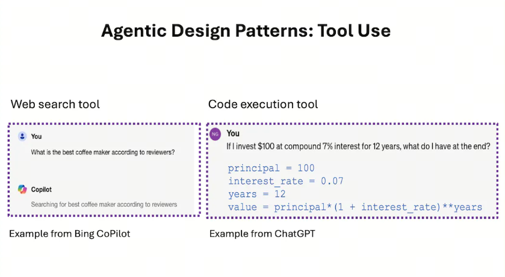
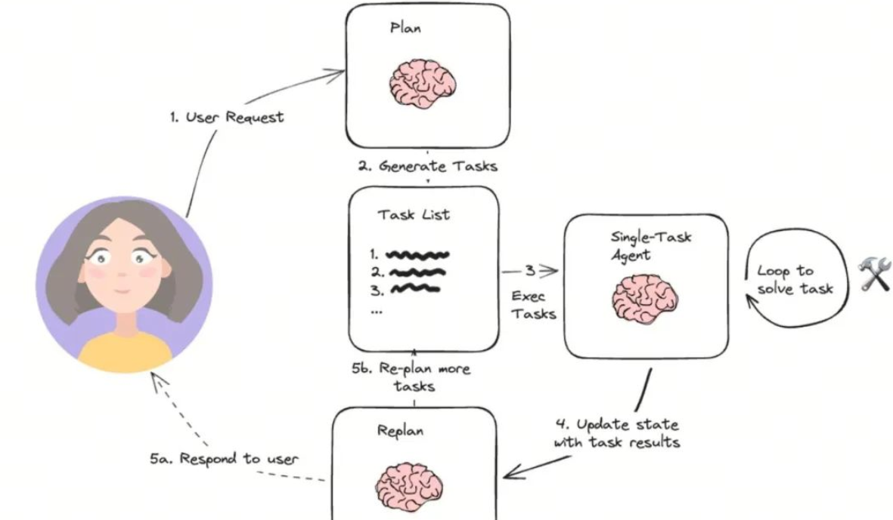
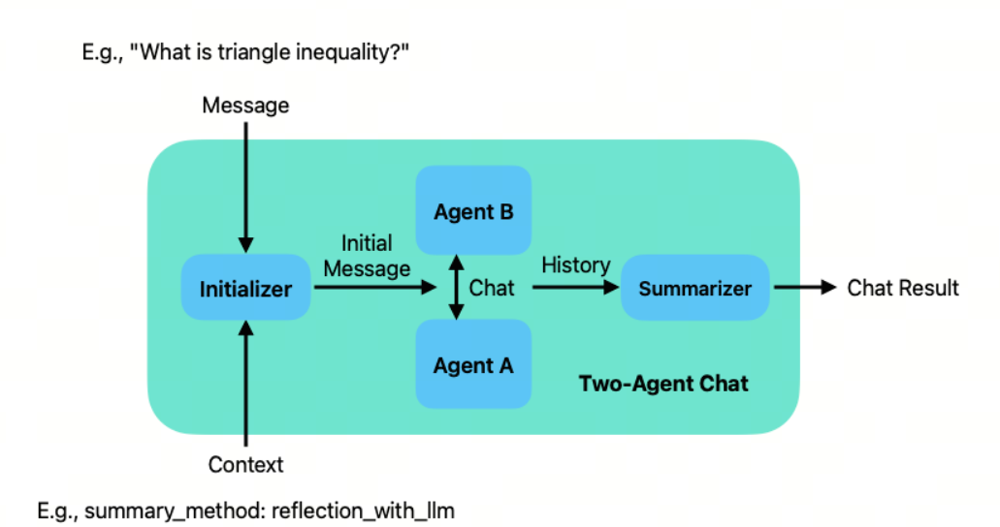
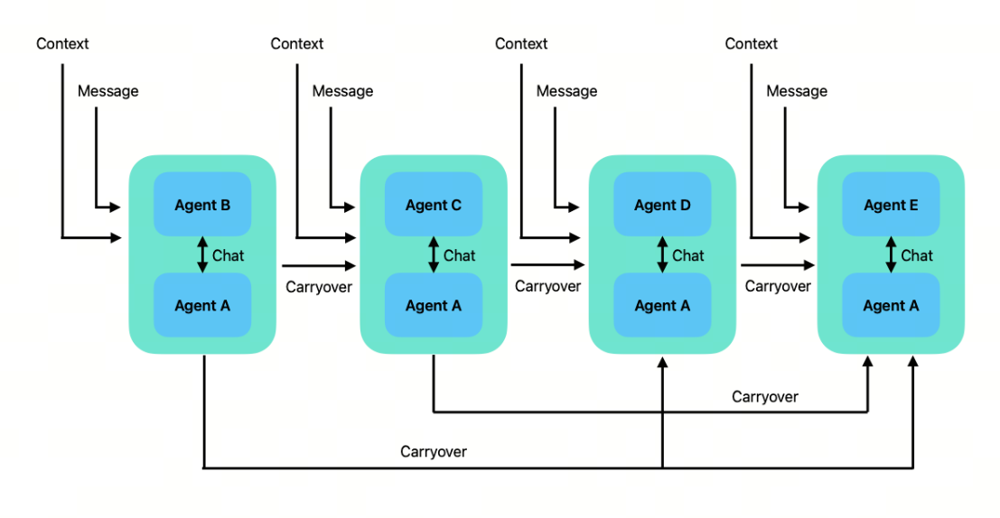
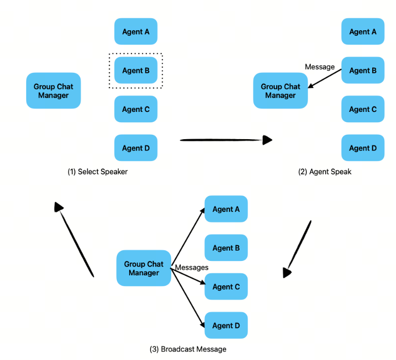
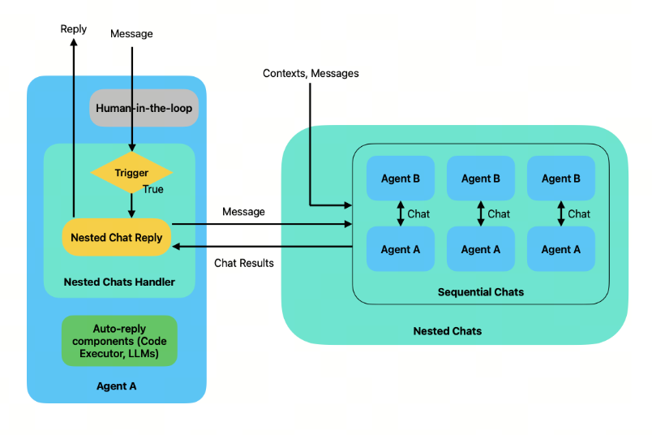

Agent设计范式与常见框架

## 1. 什么是Agent
Agent指的是一个能够感知其环境并根据感知到的信息做出决策以实现特定目标的系统，通过大模型的加持，Agent比以往任何时候都要更加引人注目。

**Agent的本质还是prompt engineering** 

## 2. Agent的设计范式
"Agent范式"是指在人工智能领域中，特别是在设计和开发智能代理（Autonomous agents 或简称 Agents）时所采用的不同方法和技术。智能代理是指能够在环境中感知、推理并采取行动以完成特定任务的系统。在大型语言模型（LLMs）的背景下，Agent范式通常涉及到如何利用这些模型来提升代理的规划、决策和执行能力。

目前没有一个统一的Agent设计范式，但是有一些常见的设计模式，我们这边选择吴恩达文章中提到的几种设计范式进行介绍:

- Reflection
- Tool use
- Planning
- Multi-agent collaboration

## 3. Agent范式一: Reflection

Reflection是指Agent能够对自己的行为和决策进行推理和分析的能力。这种能力使Agent能够更好地理解自己的行为和决策，并在未来的决策中更好地利用这些信息。


如何在工作流里面嵌入self-reflection？以一个NL2SQL的例子来说明：

### 第一次交互
```python
question = ''
prompt = f'{question}'
plain_query = llm.invoke(prompt)
try:
    df = pd.read_sql(plain_query)
    print(df)
except Exception as e:
    print(e)
```
### reflection

```python
reflection = f"Question: {question}. Query: {plain_query}. Error:{e}, so it cannot answer the question. Write a corrected sqlite query."
```

### 第二次交互

```python
reflection_prompt = f'{reflection}'
reflection_query = llm.invoke(reflection_prompt)
try:
    df = pd.read_sql(reflection_query )
    print(df)
except Exception as e:
    print(e)
```

你可以通过反思，我们可以不断改进我们的问题，直到我们得到我们想要的答案。

## 4. Agent范式二: Tool use

就像人类使用工具来帮助完成任务一样，Agent也可以使用工具来帮助完成任务。这种Agent范式涉及到Agent如何利用外部工具和资源来提升自己的决策和执行能力。



比如使用外置计算器或者wikipeida来解决我们的问题。

```python
from langchain.agents import load_tools, initialize_agent
from langchain.agents import AgentType
from langchain_openai import ChatOpenAI
llm = ChatOpenAI(temperature=0, model=llm_model)
tools = load_tools(["llm-math","wikipedia"], llm=llm)
agent= initialize_agent(
    tools, 
    llm, 
    agent=AgentType.CHAT_ZERO_SHOT_REACT_DESCRIPTION,
    handle_parsing_errors=True,
    verbose = True)

```

## 5. Agent范式三: Planning

规划是Agent AI 的一个关键设计模式，我们使用大型语言模型自主决定执行哪些步骤来完成更大的任务。例如，如果我们要求Agent对给定主题进行在线研究，我们可能会使用 LLM 将目标分解为较小的子任务，例如研究特定子主题、综合研究结果和编写报告。


## 6. Agent范式四: Multi-agent collaboration

多智能体协作是四种关键人工智能智能体设计模式中的最后一种。对于编写软件这样的复杂任务，多智能体方法会将任务分解为由不同角色（例如软件工程师、产品经理、设计师、QA（质量保证）工程师等）执行的子任务，并让不同的智能体完成不同的子任务。


## 7. 其它设计范式
其它的范式设计中的主要区别是有没有把Memory单独拎出来,你可能在各种场合见到下图这种设计范式:


和吴恩达的差别在于有没有显式的提及Memory，但是这并不影响我们的理解，因为Memory是Agent的一个重要组成部分。

Memory又可以分为Short-term memory和Long-term memory，这个和人类的记忆系统有点类似。
- Short-term memory: 就是利用上下文Context
- Long-term memory: 就是利用外挂直属库,典型的是RAG技术


## 8. 高阶的Agent设计范式

### 8.1. ReAct
Reasoning and Action，这个设计范式是指Agent根据环境的变化做出反应。这种设计范式涉及到Agent如何根据环境的变化来调整自己的决策和行为。


### 8.2. Planing & Execute



### 两者区别
- ReAct：走一步看一步
- Planing & Execute 事前计划好(当然可以再根据反馈再迭代)


***Planing vs. ReAct***

- Planning: Agent自主决定执行哪些步骤来完成更大的任务
- ReAct: Agent根据环境的变化做出反应


## 9.多智能体协作框架

### 9.1. Langgraph

以Langchain为代表的Agent框架，是目前在国内最被广泛使用的开源框架，LangChain刚开始的设计理念是将工作流设计为DAG（有向无环图），这就是Chain的由来；

随着Muti-Agent理念的兴起和Agent范式的逐渐确立，Agent工作流会越来越复杂，其中包含了循环等条件，需要用Graph图的方式，由此又开发了LangGraph。

### 9.3. AutoGen
AutoGen从组织交流的角度设计了多智能体的协作,主要分为四种策略:
- 两个agents
- 顺序agents
- Group agents
- Nested agents

### 9.4. two agents
类似于两个人协作完成任务,这个是最简单的协作模式



### 9.5. 顺序agents
顺序Agents指的是一个任务过来，agentA去轮询其它agents，每次都带着问题和前几个人的沟通结果，最终得到解决方案.


  
### 9.6. Group agents

和一个公司或者团队类似, 一个任务过来，给到manager，manager负责分发任务给不同的agent，获得反馈，广播，并选择下一个agent。



### 9.7. Nested agents

Nested agents是指一个agent里面还有一个agent，这个是最复杂的协作模式。在AutoGen中，Nested agents对外暴露一个和human交流的接口,内部是一个agent的协作。



## 参考

<div id="refer-anchor-1"></div>

[1] [www.deeplearning.ai](https://www.deeplearning.ai/the-batch/how-agents-can-improve-llm-performance/?ref=dl-staging-website.ghost.io)

[2] [autogen](https://github.com/microsoft/autogen)

## 欢迎关注我的GitHub和微信公众号，来不及解释了，快上船！

[GitHub: LLMForEverybody](https://github.com/luhengshiwo/LLMForEverybody)

仓库上有原始的Markdown文件，完全开源，欢迎大家Star和Fork！