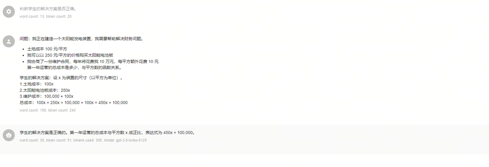
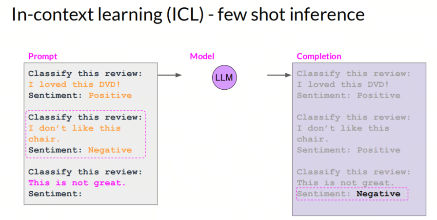

***hallucinations***


## 1. 什么是幻觉？
大模型出现幻觉，简而言之就是“胡说八道”。
用《A Survey on Hallucination in Large Language Models》[<sup>1</sup>](#refer-anchor-1)文中的话来讲，是指模型生成的内容与现实世界事实或用户输入不一致的现象。
研究人员将大模型的幻觉分为事实性幻觉（Factuality Hallucination）和忠实性幻觉（Faithfulness Hallucination）。


### 事实性幻觉

是指模型生成的内容与可验证的现实世界事实不一致。

比如问模型“第一个在月球上行走的人是谁？”，模型回复“Charles Lindbergh在1951年月球先驱任务中第一个登上月球”。实际上，第一个登上月球的人是Neil Armstrong。

事实性幻觉又可以分为事实不一致（与现实世界信息相矛盾）和事实捏造（压根没有，无法根据现实信息验证）。
### 忠实性幻觉

则是指模型生成的内容与用户的指令或上下文不一致。

比如让模型总结今年10月的新闻，结果模型却在说2006年10月的事。

忠实性幻觉也可以细分，分为指令不一致（输出偏离用户指令）、上下文不一致（输出与上下文信息不符）、逻辑不一致三类（推理步骤以及与最终答案之间的不一致）。


## 2. 处理幻觉
在生产中，我们不喜欢hallucinations，我们需要准确的、正确的回答。

在实际生产落地中，我们会循序渐进的采用如下策略来提高准确性，降低幻觉：

| 策略 | 难度| 数据要求|准确性提升|
| :--- |:----:| :----: |---: |
| Prompt engineering|低|无| 26% |
| Self-reflection |低| 无|26-40% |
| Few-shot learning (with RAG)|中|少量|50% |
| Instruction Fine-tuning |高|中等|40-60%|


## 3. Prompt Engineering
Prompt Engineering 是优化 prompts 以获得有效输出的艺术和科学。它涉及设计、编写和修改 prompts，以引导 AI 模型生成高质量、相关且有用的响应。


更多的Prompt Engineering，参见这篇文章：

[万字长文 Prompt Engineering-解锁大模型的力量](<../第六章-Prompt Engineering/assest/万字长文 Prompt Engineering-解锁大模型的力量.md>)

## 4. Self-reflection

***一个K12的例子***
指示模型在急于得出结论之前找出自己的解决方案：三思而后行！

有时，当我们明确指示模型在得出结论之前要从第一性原理进行推理时，我们会得到更好的结果。

假设我们想要一个模型来评估学生对数学问题的解决方案。 

解决这个问题最明显的方法是简单地询问模型学生的解决方案是否正确。但这样真的会得到正确的回答吗？

**错误的案例**



**正确的案例**


自我反思在大模型中经常被用于减少幻觉现象，即模型生成听起来合理但实际上不准确或无意义的信息。通过交互式自我反思方法，可以利用LLMs的多任务能力，生成、评分并不断改进知识，直到达到满意的事实性水平。

如何在工作流里面嵌入self-reflection？以一个NL2SQL[<sup>2</sup>](#refer-anchor-2)的例子来说明：

### 第一次交互
```python
question = ''
prompt = f'{question}'
plain_query = llm.invoke(prompt)
try:
    df = pd.read_sql(plain_query)
    print(df)
except Exception as e:
    print(e)
```
### reflection

```python
reflection = f"Question: {question}. Query: {plain_query}. Error:{e}, so it cannot answer the question. Write a corrected sqlite query."
```

### 第二次交互

```python
reflection_prompt = f'{reflection}'
reflection_query = llm.invoke(reflection_prompt)
try:
    df = pd.read_sql(reflection_query )
    print(df)
except Exception as e:
    print(e)
```

你可以通过反思，我们可以不断改进我们的问题，直到我们得到我们想要的答案。


## 5. Few-shot learning (with RAG)

### Few-shot learning
在prompt里面给出少量例子，帮助大模型更好的理解任务。



### RAG
检索增强生成（Retrieval-Augmented Generation，简称 RAG）通过结合大型语言模型（LLM）和信息检索系统来提高生成文本的准确性和相关性。这种方法允许模型在生成回答之前，先从权威知识库中检索相关信息，从而确保输出内容的时效性和专业性，无需对模型本身进行重新训练。

RAG技术之所以重要，是因为它解决了LLM面临的一些关键挑战，例如虚假信息的提供、过时信息的生成、非权威来源的依赖以及由于术语混淆导致的不准确响应。通过引入RAG，可以从权威且预先确定的知识来源中检索信息，增强了对生成文本的控制，同时提高了用户对AI解决方案的信任度。


### Few-shot with RAG
在基于RAG的方法中，我们可以根据查询（query）与候选例子之间的相似度，动态地选取最相关的案例作为 few-shot 学习的示例。这种方法不仅提高了模型生成的准确性，还使得模型在处理不同类型的查询时更加灵活和智能。

具体来说，RAG 通过评估查询与候选例子之间的相似度，从候选例子库中召回最相关的案例。这些被选中的案例将作为 few-shot 学习的示例，帮助模型更好地理解和生成与查询相关的内容。通过这种动态选择的方式，模型能够根据每个查询的具体需求，灵活调整所使用的示例，从而实现更高效的学习和生成。

这种方法的优势在于，它能够充分利用现有的知识库，动态响应不同的查询需求，极大地提升了模型的实用性和准确性。


## 6. Instruction Fine-tuning 
在生产上，微调是最困难的，因为[<sup>2</sup>](#refer-anchor-2)：
- 需要更多计算才能获得相同的准确度，有时候超过 10000 或 1百万倍；
- 无法在多个 GPU 上有效并行化，这样会丢失大量空闲GPU计算资源；
- 在实际用例上容易崩溃，无法在生产中连续微调和推理；
- LLM 没有改进，难以根据每一个用例、模式、数据集进行调整
- 不易使用，无法扩展（GPU 和内存问题）
- 将微调与推理相结合很容易出错

同时，你需要考虑的是如何获取**高质量的数据**？

下面以一个简单的cheet-sheet来说明获取数据的步骤[<sup>2</sup>](#refer-anchor-2)：
- 你拥有的数据比你想象的要多
- 首先，盘点一下你拥有的数据。
- 你通常拥有大量数据 - 只是格式不符合 LLMS 的要求。
- 你不想手动标记数据或清理数据以重新格式化。
- 但没关系，LLM 可以帮你！只要你指定正确的格式。

## 总结
通过上述四个策略，我们可以有效地提高大模型的准确性，降低幻觉的发生。在实际生产中，我们可以根据具体情况选择合适的策略，或者结合多种策略，以获得更好的效果。


## 参考

<div id="refer-anchor-1"></div>

[1] [A Survey on Hallucination in Large Language Models: Principles, Taxonomy, Challenges, and Open Questions](https://arxiv.org/abs/2311.05232)

<div id="refer-anchor-2"></div>

[2] [improving accuracy of llm applications](https://learn.deeplearning.ai/courses/improving-accuracy-of-llm-applications/lesson/4/create-an-evaluation)

[3] [GitHub: LLMForEverybody](https://github.com/luhengshiwo/LLMForEverybody)